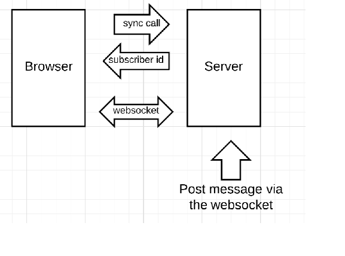
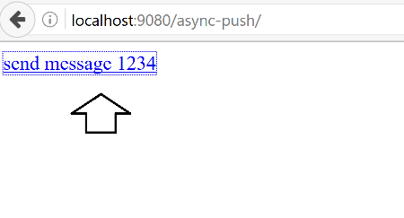
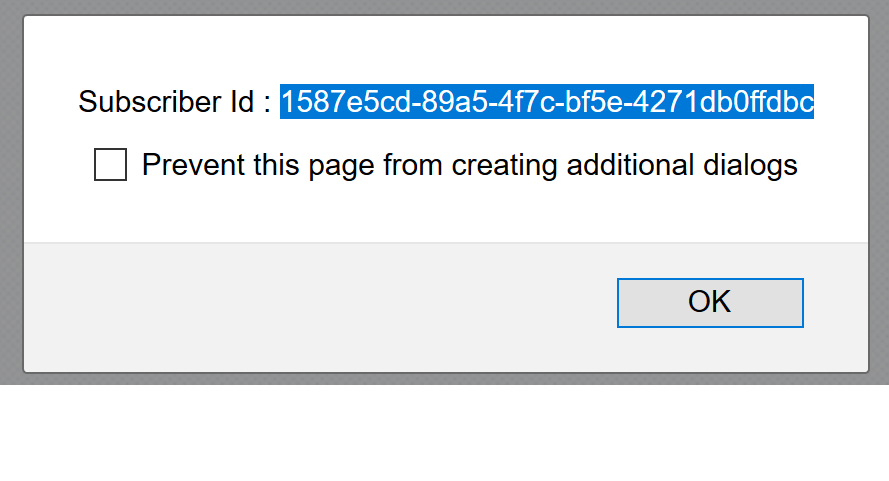
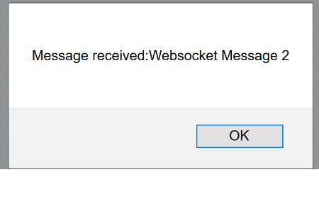

# wildfly-10-websockets
Prototype of a websocket async push implementation

## Browser support for websockets
[Browser Support](http://caniuse.com/#search=websockets)

## Details
The prototype is a JavaEE 7 app that builds as a war file and can be deployed to wildfly 10. To build the app you need maven installed and run the command "mvn clean package". Copy the war file to wildfly 10. It also requires a JMS topic "public.event" to be available on wildfly.

## Flow of information
The flow of information is as follows after you deploy the app to wildfly.

Enter the web page url in a browser and click on the send message link. The server responds with a subscriber id. The client side javascript uses the subscriber id to open a websocket. You can then use the subscriber id to simulate a server push to the browser. 




## Steps

To test the app after deployment, enter the home url and follow the steps below

### Step 1
Click on send message

This sends a message from the browser to the server. The server responds with "subscriber id" . The subscriber id is then used by the javascript on the page to open a websocket connection and wait for messages from the server.



### Step 2
Copy the subscriber id

You will need this id to simulate async messages from the server to the client.



### Step 3
Post a message using curl or python to simulate server response

example code
```python
subscriberId = "1587e5cd-89a5-4f7c-bf5e-4271db0ffdbc"
payload = "Websocket Message 2"
headers = {"content-type": "text/plain"}
r = requests.post("http://localhost:9080/async-push/rest/push-msg/"+subscriberId, data=payload, headers=headers)
```

### Step 4




